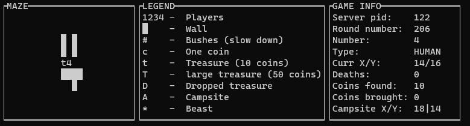
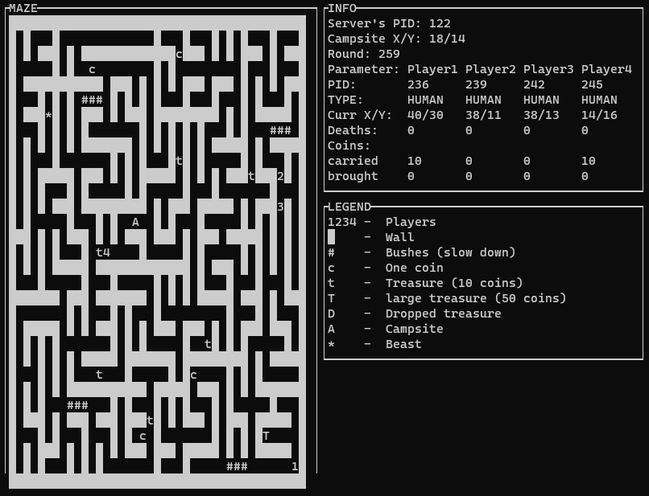

# IPC-game
<h3>A simple IPC pacman-like game mady by using C programming langauge.</h3>

<h3>Client view:</h3>

<h3>Server view:</h3>

<b>commands for linux:</b>

running a <b>server</b>: "gcc main.c -o server -lpthread -lrt -lcurses -lm && ./server"

running a <b>client</b>(up to 4): "gcc client.c -o client -lpthread -lrt -lcurses -lm && ./client"

<b>Features:</b>
* turn-based<
* 4 playable concurrent players
* spawning up to 3 enemies
* spawning up to 20 collectable treasures
* droping loot after death
* bushes that slow you down for 1 turn
* a game log and monitoring interface for the server

<b>List of IPC tools that I used:</b>
* threads
* mutexes
* unamed and named semaphores
* shared memory

